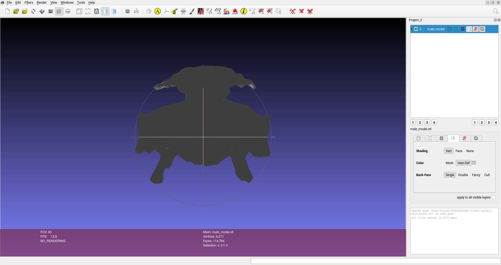
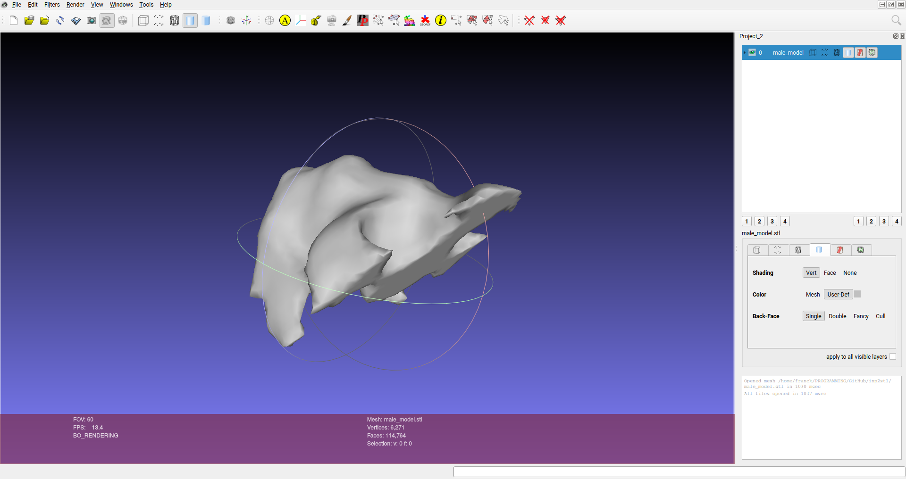
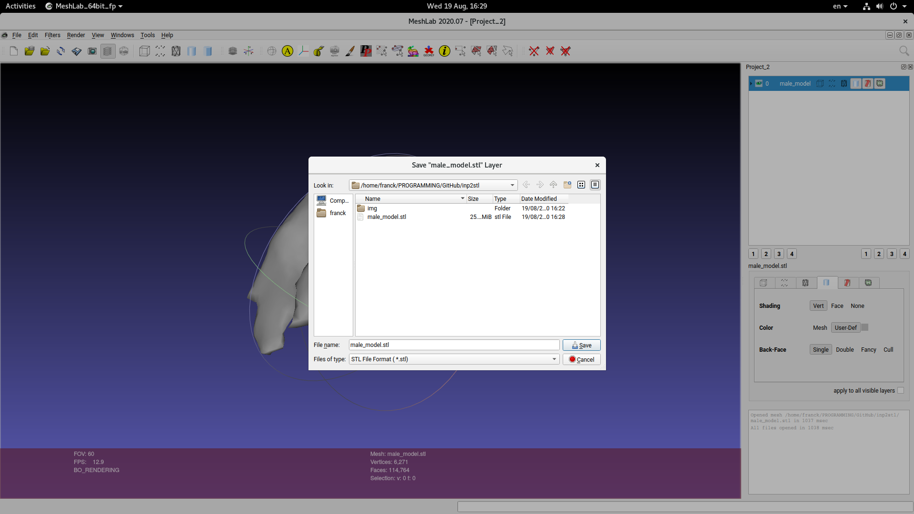
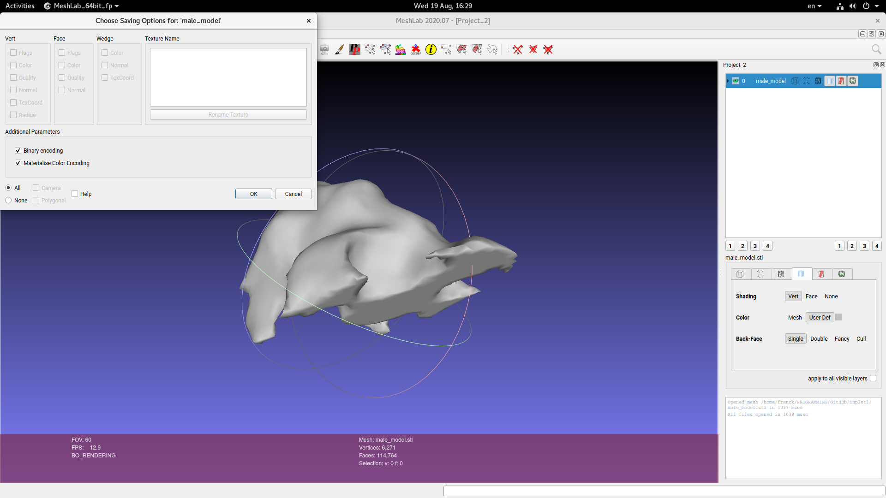

# inp2stl
Python script to convert a file in Abacus' INP format into the STL (STereoLithography) file format


## Requirements

Install the requirements if needed using:

```bash
$ python3 -m pip install --user numpy
```

## Usage

```bash
inp2stl.py [-h] --input INPUT --output OUTPUT [--flip [FLIP]]

Detect peas.

optional arguments:
  -h, --help       show this help message and exit
  --input INPUT    Name of the input INP file.
  --output OUTPUT  Name of the output STL file.
  --flip [FLIP]    Flip normal vectors.
```

## Example

- Download an INP file, e.g. the male_model from Harsha Teja Garimella (2018) available on [figshare](https://figshare.com/) at [https://doi.org/10.6084/m9.figshare.5808792.v1](https://doi.org/10.6084/m9.figshare.5808792.v1):

```bash
$ wget https://ndownloader.figshare.com/files/10269141
$ mv 10269141 male_model.inp
```

- Convert the INP file into an STL file:

```bash
$ ./inp2stl.py --input male_model.inp --output male_model.stl
```

- Check the direction of the normal vectors, e.g. using [MeshLab](https://www.meshlab.net/)



It's not pretty, isn't it?


- I've seen vertex ordering using left-hand rule and right-hand rule. It's why we can flip the normals, e.g.:

```bash
$ ./inp2stl.py --flip --input male_model.inp --output male_model.stl
```



## Case study: X-ray simulation using gVirtualXRay

- In MeshLab, `export the mesh as` a binary STL file.



- Use a different filename, e.g. I added `-bin` at the end of the filename.


- Make sure the format is binary



The file name should be much smaller than the ASCII file

```bash
$ ls -l male_model*.stl
-rw-r--r-- 1 franck users  5738284 Aug 19 16:29 male_model-bin.stl
-rw-r--r-- 1 franck users 27048282 Aug 19 16:28 male_model.stl
```

- Install gvxrPython3

See...

The Python wrapper is installed in ``/home/franck/gvxrWrapper-1.0.1/python3`
 on my computer.

 ```bash
$ cd /home/franck/gvxrWrapper-1.0.1/python3
$ ls
gvxrPython3.py  _gvxrPython3.so  test.py
```

- I add this path in `PYTHONPATH` in my `.bashrc` file with:

```bash
$ echo "" >> ~/.bashrc
$ echo "# Install of gvxrPython3" >> ~/.bashrc
$ echo "export PYTHONPATH=/home/franck/gvxrWrapper-1.0.1/python3:$PYTHONPATH" >> ~/.bashrc
```

- Run the X-ry simulation:

```bash
$ ./gvxrPythonTest.py
```
